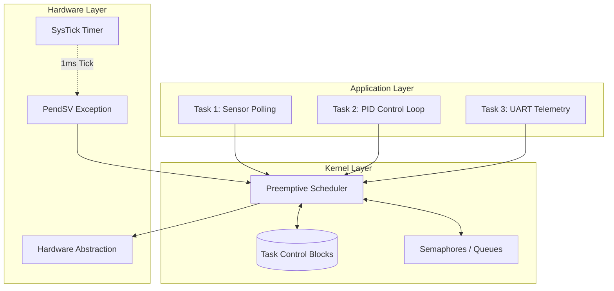
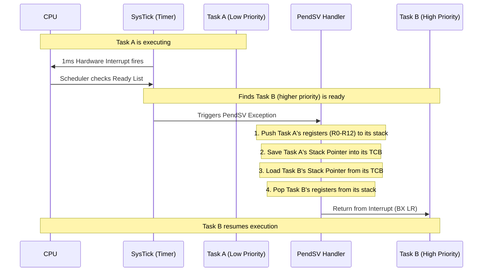
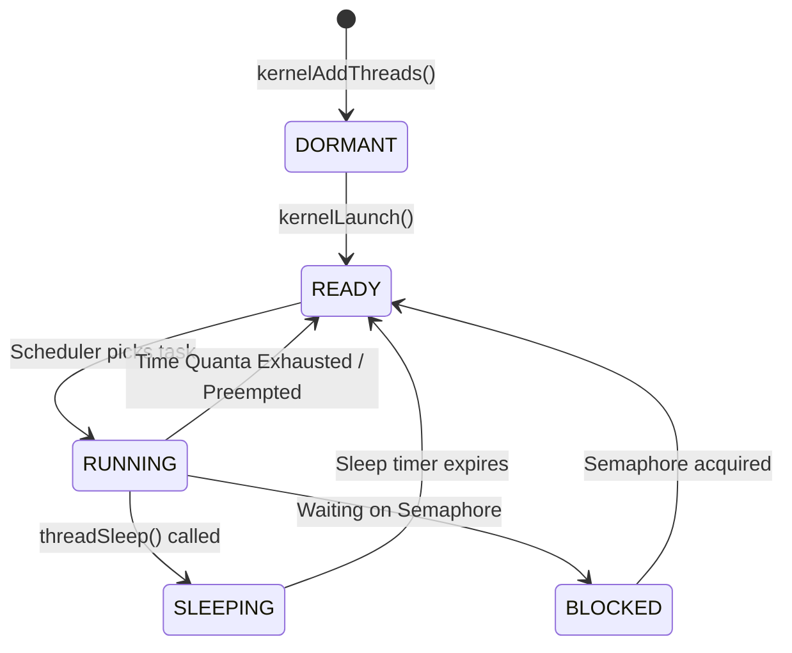
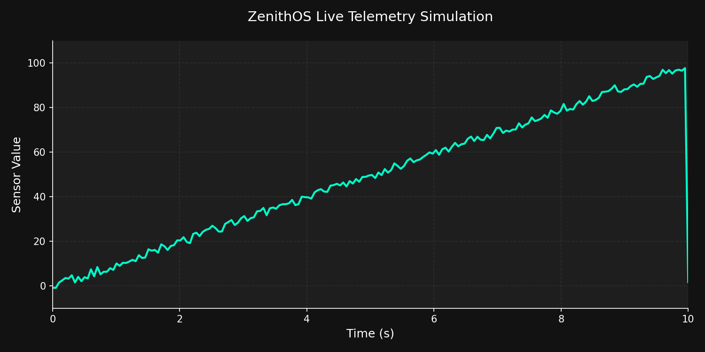

# ZenithOS: A Custom Preemptive RTOS for ARM Cortex-M4

I built ZenithOS as a personal project to deeply understand how a Real-Time Operating System works under the hood, rather than just using FreeRTOS as a black box. It's a minimal, preemptive kernel written from scratch in C and ARM Assembly, specifically targeting the STM32F4 series (Cortex-M4).

The goal wasn't to replace existing RTOS solutions, but to learn how context switching, the ARM NVIC, memory management, and task scheduling actually function at the bare-metal level.

## System Architecture

To keep the application logic decoupled from the hardware, I structured the OS into three layers. 



## How the Context Switch Works

The hardest part of this project was wrapping my head around the `PendSV` exception. In ARM Cortex-M, you don't want to perform a context switch directly inside the SysTick timer interrupt, because it might preempt other important hardware interrupts. Instead, SysTick triggers a `PendSV` (Pendable Service Call), which is a low-priority interrupt dedicated specifically to OS context switching.

Here is a visual breakdown of how the kernel forces the CPU to switch from a low-priority task to a higher-priority one:



## Task Lifecycle

The scheduler manages tasks through four main states. It always scans the Ready list to pick the highest priority task available.



## Building and Running

You'll need the standard GNU ARM toolchain (`arm-none-eabi-gcc`). This project purposely avoids heavy IDEs like STM32CubeIDE to keep the build process transparent.

```bash
make
make flash
```

## Telemetry Dashboard & Simulation

Since staring at blinking LEDs isn't the most descriptive way to debug an OS, I wrote a Python script to visualize the UART telemetry stream. 



If you don't have an STM32 board handy, you can run the script in simulation mode to see how the data visualization works:

```bash
pip install pyserial matplotlib
python tools/telemetry_dashboard.py --simulate
```

To run it with a physical board connected:
```bash
python tools/telemetry_dashboard.py --port COM3
```

---
*Built for educational purposes. Feel free to use the scheduler code as a reference if you are learning ARM architecture.*
