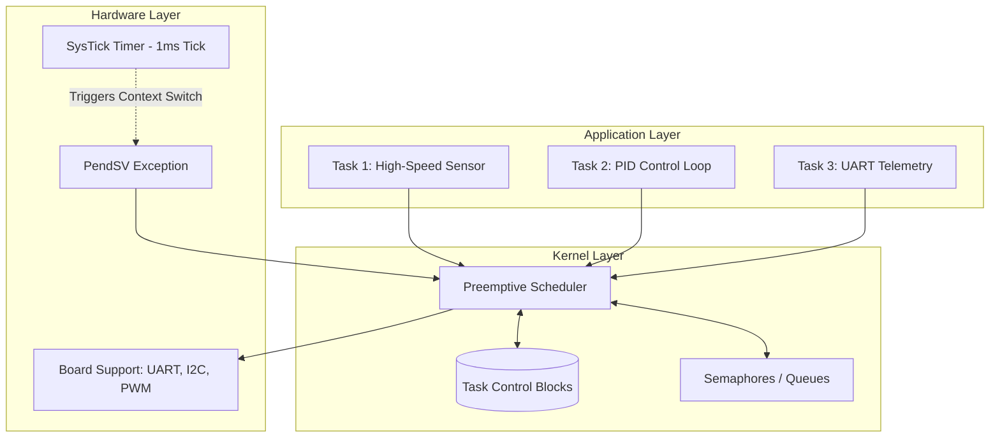
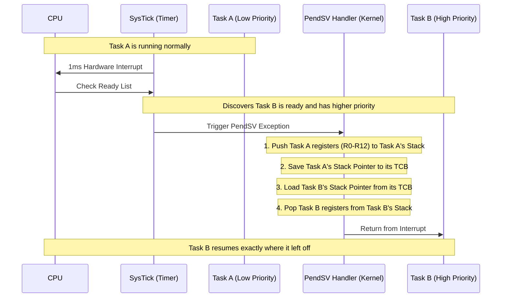
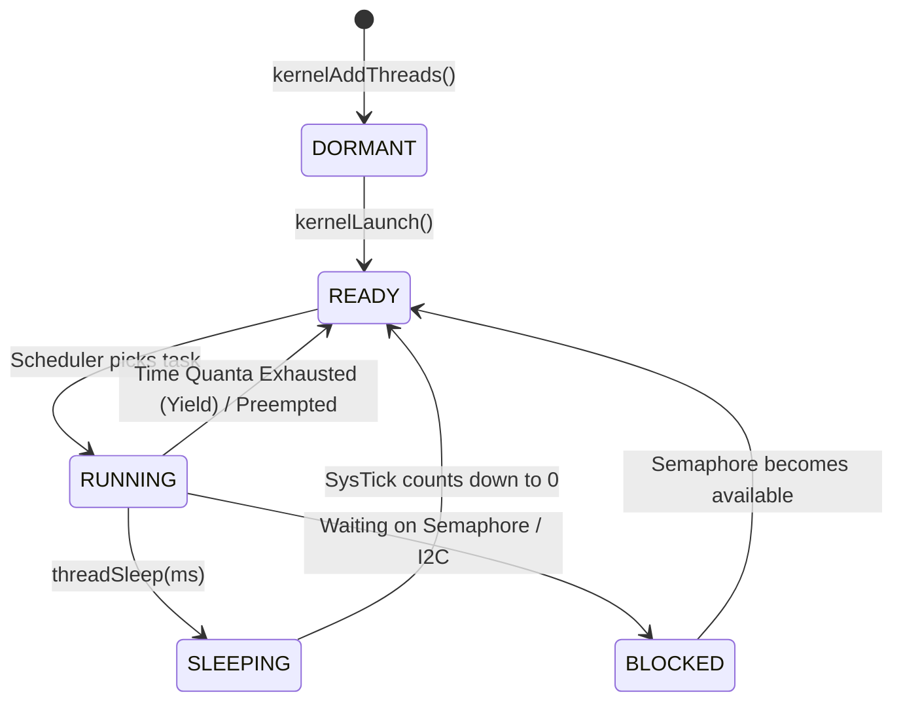

# ZenithOS: Custom Preemptive RTOS for ARM Cortex-M4

ZenithOS is a minimal, preemptive Real-Time Operating System (RTOS) designed from scratch for the ARM Cortex-M4 architecture (specifically targeting the STM32F4 series). It serves as an educational dive into kernel internals, context switching, and hardware-level task scheduling.

## 📊 System Architecture

The OS is divided into three distinct layers, ensuring that the application logic does not directly touch hardware registers.



## 🧠 How Context Switching Works (The PendSV Magic)

Unlike standard C programs, an RTOS must forcefully pause a function mid-execution, save its exact state, and resume another. In ARM Cortex-M, this is done using the `PendSV` (Pendable Service Call) interrupt.



## 🔄 Task State Machine

Every task in ZenithOS exists in one of four states. The scheduler's job is to look at the Ready list and pick the highest priority task.



## 🛠 Getting Started

### Hardware Setup
*   **Board**: STM32F4-Discovery or STM32 Nucleo-F4xx.
*   **Debugger**: ST-Link V2 (built-in).

### Building and Flashing
This project uses a standard `Makefile`. You will need the `arm-none-eabi-gcc` toolchain.

```bash
make
make flash
```

## 💻 Simulation & Telemetry Dashboard

If you don't have the hardware board yet, or want to visualize the output of the RTOS on your PC, you can use the included Python Telemetry Dashboard.

**Dependencies:**
```bash
pip install pyserial matplotlib
```

**Running the Simulation (No Board Required):**
This will simulate the UART output of the RTOS and plot the dummy sensor data generated in `main.c` exactly as if it were coming from a physical board.
```bash
python tools/telemetry_dashboard.py --simulate
```

**Running with Real Hardware:**
Connect your STM32 to your PC, find the COM port (e.g., `COM3` on Windows, `/dev/ttyACM0` on Linux), and run:
```bash
python tools/telemetry_dashboard.py --port COM3
```

## 📝 Portfolio Notes
*This project was built to demonstrate a deep understanding of bare-metal C programming, ARM assembly, and operating system design principles. By avoiding standard libraries like FreeRTOS, this repository proves an ability to manipulate hardware registers directly and design memory-safe architectures in constrained environments.*
